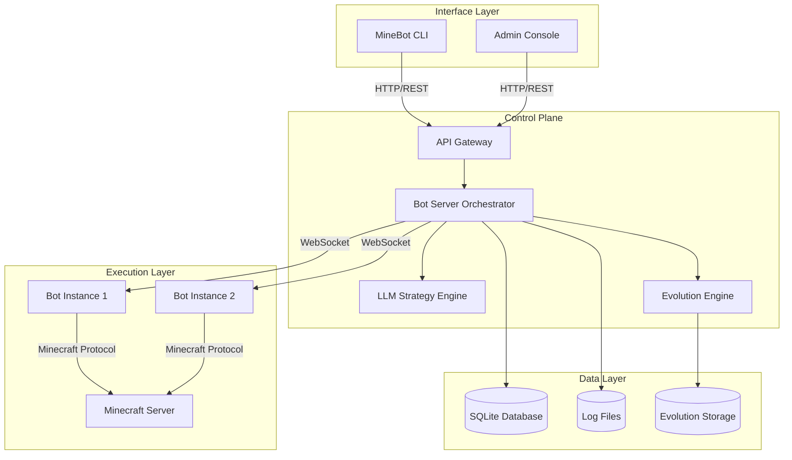
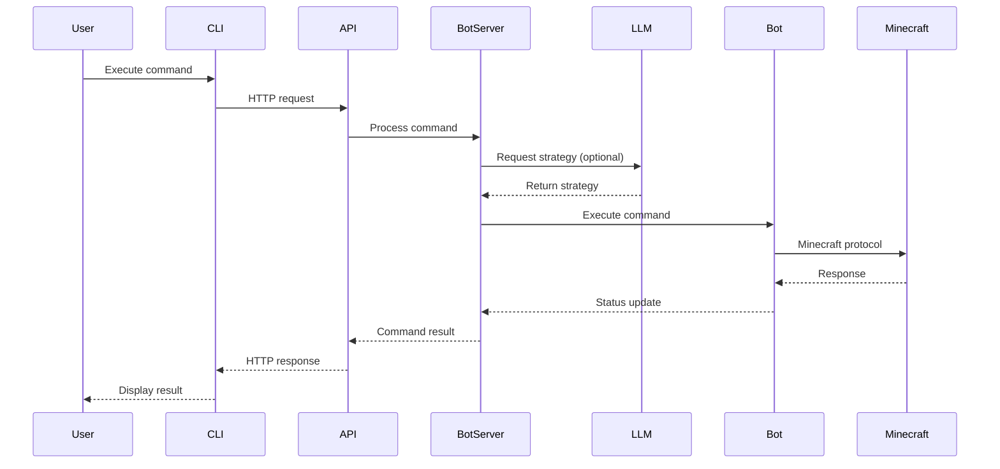

# MineBot System Architecture Documentation

| Version | Date | Status | Author |
| :--- | :--- | :--- | :--- |
| v2.0 | 2026-04-07 | Comprehensive Documentation | Sisyphus AI Agent |

## 1. Executive Summary

MineBot is an AI-driven robotic system for Minecraft Java Edition that provides automated bot management, intelligent task execution, and evolutionary learning capabilities. The system combines a Node.js backend with a CLI interface, LLM integration, and a sophisticated evolution engine for adaptive bot behavior.

## 2. System Overview

### 2.1 Core Architecture Principles

- **Decoupled Distributed Architecture**: Separation of user interface, control logic, and execution layers
- **Event-Driven Design**: Real-time communication via WebSocket and event handlers
- **Modular Component Design**: Independent modules with clear interfaces and responsibilities
- **Evolutionary Learning**: Adaptive bot behavior through experience-based learning
- **Multi-Layer Persistence**: SQLite for configuration, file system for logs, in-memory for runtime state

### 2.2 System Topology



## 3. Component Architecture

### 3.1 Bot Server Orchestrator (`bot_server.js`)

**Responsibilities**:
- Central coordination of all bot instances
- WebSocket server for real-time bot communication
- REST API endpoint management
- Bot lifecycle management (spawn, monitor, terminate)
- Database connection management

**Key Components**:
- `activeBots`: Map tracking all active bot instances
- `botConnections`: WebSocket connection management
- `retryQueue`: Failure recovery mechanisms
- PID file management for single instance guarantee

### 3.2 Bot Runtime System (`bot/` directory)

**Core Bot Class** (`bot/index.js`):
- Mineflayer bot wrapper with enhanced capabilities
- WebSocket client for server communication
- Event handler integration
- Pathfinding and navigation system

**Subsystems**:
- `bot/pathfinder.js`: Advanced navigation algorithms
- `bot/events.js`: Event handling and state management
- `bot/logger.js`: Centralized logging system
- `bot/behaviors.js`: Behavior definitions and execution
- `bot/autonomous-engine.js`: Autonomous task execution
- `bot/goal-system.js`: Goal-oriented task management

### 3.3 Evolution Engine (`bot/evolution/`)

**Architecture**:
```
Evolution Engine
├── Strategy Manager (strategy-manager.js)
├── Weight Engine (weight-engine.js)
├── Fitness Calculator (fitness-calculator.js)
├── Evolution Storage (evolution-storage.js)
├── Experience Logger (experience-logger.js)
└── Evolution Database (SQLite)
```

**Learning Process**:
1. **Experience Collection**: Bot actions and outcomes logged
2. **Fitness Evaluation**: Performance metrics calculated
3. **Weight Adjustment**: Strategy weights updated based on success
4. **Strategy Evolution**: New strategies generated and tested
5. **Persistence**: Learning outcomes stored for future use

### 3.4 LLM Integration (`llm/` directory)

**Components**:
- `llm/index.js`: REST API gateway for LLM services
- `llm/strategy.js`: Strategy engine with fallback mechanisms
- Configuration: VLLM endpoint or local fallback strategy

**Operation Modes**:
1. **VLLM Mode**: External LLM service for complex strategy generation
2. **Fallback Mode**: Rule-based strategy system for reliability
3. **Hybrid Mode**: Dynamic switching based on service availability

### 3.5 Data Layer (`config/` directory)

**Database Models**:
- `BotConfig`: Bot configuration and settings
- `BotState`: Runtime bot state and status
- `BotGoal`: Goal definitions and tracking

**Database Management**:
- SQLite3 for lightweight persistence
- Schema migrations and versioning
- Connection pooling and error handling

### 3.6 Streaming System (`streaming/` directory)

**Components**:
- `StreamManager`: Central coordination of streaming sessions
- `BotStream`: Individual bot streaming capabilities
- `ScreenshotModule`: Visual capture and processing

**Use Cases**:
- Real-time bot monitoring
- Visual feedback for debugging
- Recording bot activities

### 3.7 CLI Interface (`cli.js`)

**Features**:
- Interactive admin console with multiple views
- Real-time bot status monitoring
- Command execution and history
- Performance monitoring and tuning
- Color-coded terminal output

**View System**:
- Dashboard: System overview
- Bot Management: Individual bot control
- Log Viewer: System logs
- Configuration: Settings management

## 4. Data Flow and Communication

### 4.1 Command Execution Flow



### 4.2 Real-time Communication

**WebSocket Protocol**:
- **Connection**: Bot ↔ Bot Server bidirectional communication
- **Messages**: JSON-formatted commands and status updates
- **Heartbeat**: Regular ping/pong for connection health
- **Reconnection**: Automatic reconnection with exponential backoff

**Event System**:
- Bot events (spawn, chat, death, etc.)
- System events (startup, shutdown, errors)
- Custom events for application logic

## 5. Configuration Management

### 5.1 Environment Configuration (`.env`)

**Categories**:
- Server Configuration (HOST, PORT, LOG_DIR)
- Minecraft Server Settings
- Bot Server Connection
- LLM/AI Configuration
- Frontend Configuration
- Timing Configuration
- Bot Behavior Configuration
- Security Settings

### 5.2 Configuration Files

- `package.json`: Project metadata and dependencies
- `config/db.js`: Database connection configuration
- `config/validate.js`: Configuration validation
- `config/models/`: Data model definitions

## 6. Dependencies and Technology Stack

### 6.1 Core Dependencies

**Runtime**:
- `express`: Web server framework
- `mineflayer`: Minecraft bot library
- `mineflayer-pathfinder`: Navigation system
- `ws`: WebSocket implementation
- `sqlite3`: Database persistence
- `vec3`: 3D vector mathematics

**Development**:
- `jest`: Testing framework
- `supertest`: HTTP testing
- `nodemon`: Development hot reload

### 6.2 Architecture Patterns

| Pattern | Implementation | Purpose |
| :--- | :--- | :--- |
| **Singleton** | Database connections, configuration | Single instance management |
| **Observer** | Event system, status monitoring | Decoupled notification |
| **Strategy** | LLM integration, behavior selection | Algorithm variation |
| **Factory** | Bot creation, module instantiation | Object creation abstraction |
| **Command** | CLI commands, bot instructions | Request encapsulation |
| **Repository** | Data access layer | Data persistence abstraction |

## 7. Deployment Architecture

### 7.1 Runtime Environment

**Requirements**:
- Node.js 16+ runtime
- SQLite3 database
- Minecraft Java Edition server
- Network connectivity between components

**Process Management**:
- PID file for single instance enforcement
- Log rotation and management
- Process monitoring and recovery

### 7.2 Scaling Considerations

**Vertical Scaling**:
- Multiple bot instances per server
- Connection pooling optimization
- Memory management for large bot counts

**Horizontal Scaling** (Future):
- Multiple Bot Server instances
- Load balancing for API requests
- Shared database backend

## 8. Security Considerations

### 8.1 Authentication & Authorization

- Microsoft OAuth for Minecraft authentication
- Environment-based secret management
- API endpoint access control

### 8.2 Network Security

- Local network deployment by default
- Configurable host/port binding
- CORS configuration for web interfaces

### 8.3 Data Security

- SQLite database file permissions
- Log file access controls
- Environment variable protection

## 9. Monitoring and Observability

### 9.1 Logging System

**Levels**: TRACE, DEBUG, INFO, WARN, ERROR
**Destinations**: Console, file system, remote (future)
**Format**: Structured JSON with timestamps

### 9.2 Metrics Collection

- Bot connection status
- Command execution latency
- Resource utilization (CPU, memory)
- Error rates and types

### 9.3 Health Checks

- `/api/health`: System health endpoint
- Database connectivity verification
- External service availability (LLM, Minecraft)

## 10. Future Architecture Evolution

### 10.1 Planned Enhancements

1. **Microservices Architecture**: Split monolithic server into specialized services
2. **Containerization**: Docker support for easier deployment
3. **Cloud Integration**: AWS/Azure deployment options
4. **Advanced AI**: Reinforcement learning integration
5. **Plugin System**: Extensible architecture for custom behaviors

### 10.2 Technical Debt Considerations

- Test coverage improvement
- TypeScript migration
- API documentation generation
- Performance benchmarking suite

## 11. Glossary

| Term | Definition |
| :--- | :--- |
| **Bot** | A Minecraft client instance controlled by MineBot |
| **Orchestrator** | Central Bot Server managing all bot instances |
| **Evolution Engine** | Learning system adapting bot behavior over time |
| **LLM Strategy** | AI-generated task plans for bots |
| **WebSocket** | Real-time bidirectional communication protocol |
| **Mineflayer** | Node.js Minecraft bot library |

---

*This document provides a comprehensive overview of the MineBot system architecture. For implementation details, refer to the source code and API documentation.*