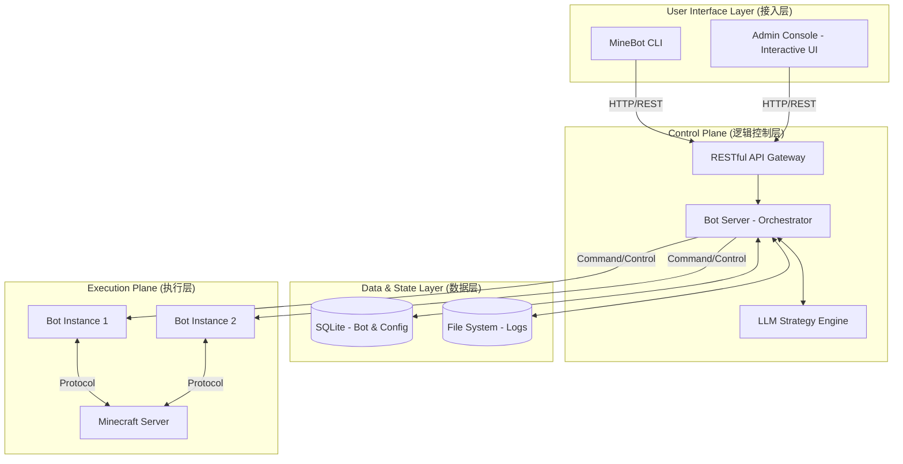
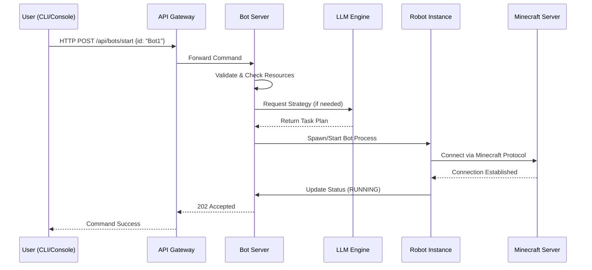

# MineBot 系统架构分析报告 (Architecture Analysis Report)

| 版本 | 日期 | 状态 | 作者 |
| :--- | :--- | :--- | :--- |
| v1.0 | 2026-04-06 | 草案 | opencode |

## 1. 宏观架构设计 (Macro Architecture)

MineBot 采用了**解耦的分布式架构模型**，将用户交互、业务逻辑与底层执行环境完全分离。

### 1.1 系统架构拓扑图 (System Topology)

### 1.2 分层架构模型

MineBot 在逻辑上分为三个核心层级：

1.  **接入层 (Interface Layer)**:
    *   **CLI (Command Line Interface)**: 适用于自动化脚本、CI/CD 集成和快速单次指令操作。
    *   **Admin Console (Interactive UI)**: 提供基于终端的交互式图形界面，适用于实时监控、人工介入和复杂的系统维护。
    *   **设计哲学**: 接入层不处理任何业务逻辑，仅负责指令解析、参数验证及结果的可视化展示。

2.  **逻辑控制层 (Orchestration Layer / Bot Server)**:
    *   充当系统的“大脑”。通过 RESTful API 接收来自接入层的请求。
    *   负责 Bot 的生命周期管理、任务调度、LLM 策略解析以及状态同步。
    *   **解耦意义**: 通过 API 隔离，接入层崩溃不会影响 Bot 的运行；同时可以轻松扩展 Web 版或移动版接入层。

3.  **执行层 (Execution Layer)**:
    *   **Bot Instances**: 实际在 Minecraft 世界中进行物理操作的逻辑单元。
    *   **Minecraft Server**: 底层游戏环境，通过协议层与 Bot 实例进行交互。

---

## 2. 核心组件深度解析 (Component Deep Dive)

### 2.1 指令执行时序图 (Command Execution Flow)

以下展示了用户通过 CLI 发送一条指令到机器人执行完毕的完整生命周期：

### 2.2 Admin Console 交互引擎

Admin Console 并非简单的文本输出，而是一个基于**状态机 (State Machine)** 的终端图形化引擎。

*   **视图切换机制 (View Switching)**: 系统维护一个 `currentView` 状态。用户通过输入编号或快捷键触发状态迁移，引擎根据当前状态调用对应的 `render{View}()` 方法。
*   **渲染管道 (Rendering Pipeline)**:
    1.  `clearScreen()`: 清除缓冲区。
    2.  `drawHeader/Footer()`: 绘制固定框架。
    3.  `drawBody()`: 根据视图类型，从 Data Provider 获取数据并渲染表格、卡片或菜单。
*   **性能优化 (Performance Tuning)**: 引入了 **Debounce (防抖)** 和 **Throttling (节流)** 机制。即使系统状态变化极快，渲染频率也会被限制在可控范围内，防止终端闪烁和 CPU 过载。

### 2.3 机器人策略引擎 (Bot Strategy Engine)

机器人不再是简单的脚本，而是具备“目标-动作”链条的智能体：
*   **目标解析**: LLM 将模糊的用户指令（如“去挖钻石”）转化为结构化的任务目标。
*   **行为拆解**: 任务目标被拆解为一系列原子动作（移动 $\rightarrow$ 挖掘 $\rightarrow$ 整理背包）。
*   **反馈循环**: 机器人不断采集环境状态（Position, Inventory, Health），并将其反馈给策略引擎进行动态修正。

---

## 3. 数据流与状态管理 (Data Flow & State Management)

### 3.1 指令流转路径 (Command Flow)

用户执行一条指令（如 `minebot bot start MyBot`）的完整路径如下：

1.  **解析阶段**: CLI 解析参数 $\rightarrow$ 识别系统 (`bot`) 和动作 (`start`) $\rightarrow$ 提取参数 (`MyBot`)。
2.  **传输阶段**: CLI 构建 HTTP POST 请求 $\rightarrow$ 发送至 Bot Server 接口 `/api/bots/start`。
3.  **执行阶段**: Bot Server 验证权限与参数 $\rightarrow$ 实例化/唤醒 Bot 进程 $\rightarrow$ 启动任务。
4.  **反馈阶段**: 服务器返回 HTTP 响应 $\rightarrow$ CLI 显示成功/失败消息。

### 3.2 状态一致性

系统采用**权威服务器模式 (Authoritative Server Model)**。所有的状态数据（如 Bot 坐标、生命值、服务器负载）均以 Bot Server 内存中的数据为准。Admin Console 通过定时轮询 (Polling) 获取最新快照，确保了用户看到的视图是系统真实状态的近似实时反映。

---

## 4. 设计模式应用 (Design Patterns)

MineBot 在实现过程中广泛应用了以下设计模式：

| 模式 | 应用场景 | 带来的价值 |
| :--- | :--- | :--- |
| **Command (命令模式)** | CLI 解析与分发 | 将请求封装为对象，实现指令的可撤销、重试及高度模块化。 |
| **Singleton (单例模式)** | 配置管理与数据库连接 | 确保全局范围内配置的一致性，减少资源开销。 |
| **Observer (观察者模式)** | 系统状态监控与告警 | 当系统指标（如 CPU）超过阈值时，自动触发告警机制。 |
| **Strategy (策略模式)** | 机器人行为逻辑 | 允许根据环境（如白天/黑夜、安全/危险）动态切换不同的行动策略。 |
| **Template Method (模板方法)** | UI 渲染流程 | 定义了标准的渲染步骤（Header $\rightarrow$ Body $\rightarrow$ Footer），简化了新视图的开发。 |

---

## 5. 安全性与可靠性设计 (Reliability & Security)

### 5.1 容错与自愈 (Fault Tolerance)

*   **进程隔离**: Bot 进程通过 PID 文件管理，异常退出时可通过 Admin Console 快速探测并重启。
*   **错误边界 (Error Boundaries)**: 在 Admin Console 的渲染循环中设置了全局错误捕获。当某个视图渲染失败时，系统不会崩溃，而是自动尝试恢复到 `Dashboard` 视图。

### 5.2 资源约束 (Resource Constraints)

*   **速率限制 (Rate Limiting)**: 对 API 请求频率和渲染频率进行了严格限制，防止因操作过快导致的系统假死。
*   **并发控制**: 在执行高负载操作（如大规模清理或备份）时，通过锁机制确保不会同时启动多个冲突的进程。

---
*End of Report*

